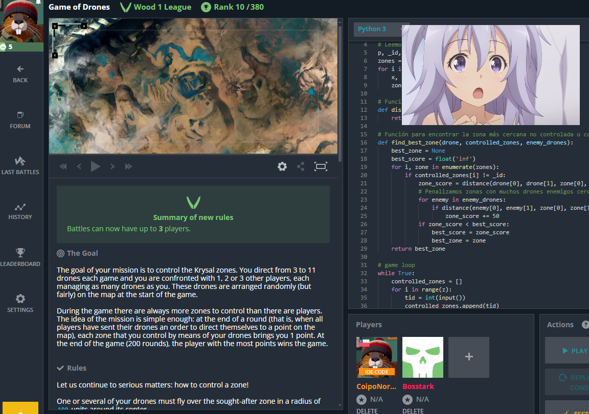

# Games-of-Drones-
Solucion maoma a Games of Drones un desafio de Coding Games creo

# Estrategia de Control de Zonas con Drones

## Descripción de la Estrategia

Esta estrategia se enfoca en el control y la gestión de zonas en un entorno de juego utilizando drones. A continuación se detalla el proceso seguido en cada turno del juego:

### Almacenamiento Inicial de Información

- **Al inicio del juego**, almacenamos la información de las zonas disponibles.

### Proceso por Turno

1. **Actualización del Estado de Control de Zonas**
   - Se actualiza el estado de control de cada zona para reflejar los cambios recientes.

2. **Obtención de Posiciones de Drones**
   - Se obtienen las posiciones actuales de todos los drones, tanto nuestros como enemigos.

3. **Asignación de Objetivos a Nuestros Drones**
   - Para cada uno de nuestros drones:
     - **Búsqueda de la Mejor Zona Objetivo**
       - Utilizamos la función `find_best_zone` para determinar la mejor zona objetivo. 
       - Consideramos zonas que no están controladas o que están controladas por enemigos.
       - Calculamos una puntuación basada en la distancia a la zona.
       - Penalizamos las zonas que tienen una alta concentración de drones enemigos cercanos.
     - **Movimiento hacia el Objetivo**
       - Si el objetivo está a más de 100 unidades de distancia, movemos el dron 100 unidades en esa dirección.
       - Si no hay zonas disponibles (todas las zonas están controladas), movemos el dron hacia el centro del mapa.

4. **Mensajes de Depuración**
   - Añadimos mensajes de depuración para visualizar el estado actual de las zonas controladas y los objetivos de nuestros drones.

## Ventajas de Esta Estrategia

- **Priorización Inteligente**: Se da preferencia a zonas que no están controladas o que están bajo control enemigo.
- **Evitación de Zonas Peligrosas**: Se evitan zonas con una alta concentración de drones enemigos.
- **Distribución Eficiente**: Los drones se distribuyen entre diferentes objetivos para maximizar la cobertura.
- **Adaptabilidad**: La estrategia se adapta dinámicamente al estado del juego en cada turno, optimizando la toma de decisiones.

## Notas Adicionales

- La estrategia está diseñada para mejorar la eficiencia y el control de las zonas mediante una asignación inteligente de objetivos y una gestión adecuada de los recursos (drones).
- Los mensajes de depuración son útiles para el seguimiento y ajuste de la estrategia durante el desarrollo del juego.

## Imagen de la Estrategia

